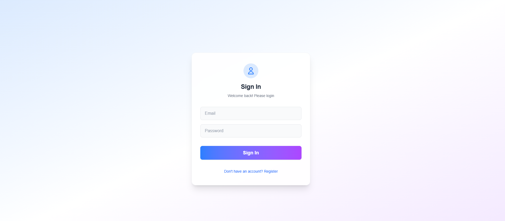
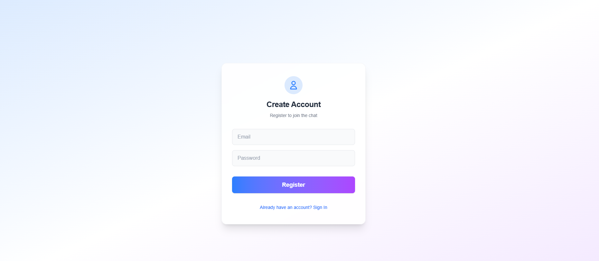
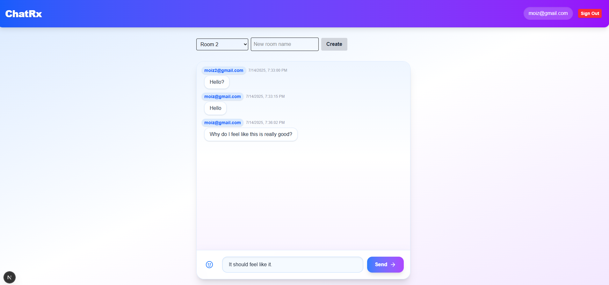
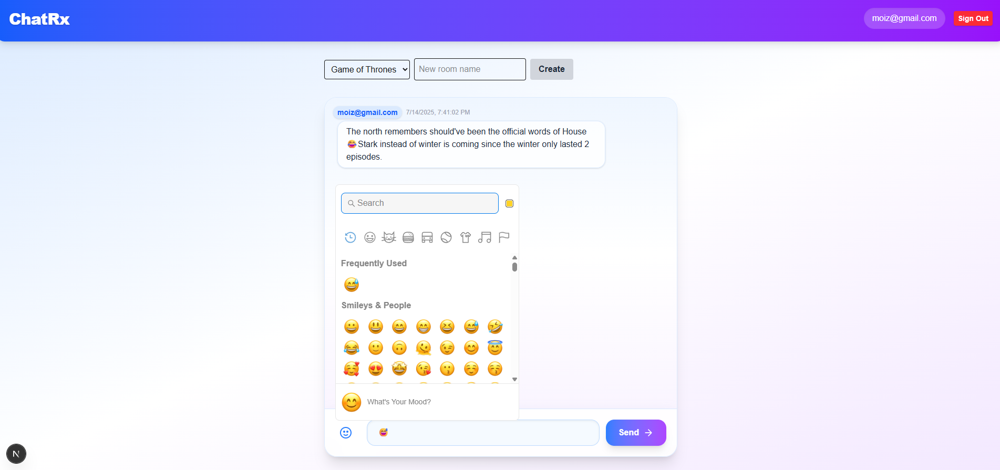
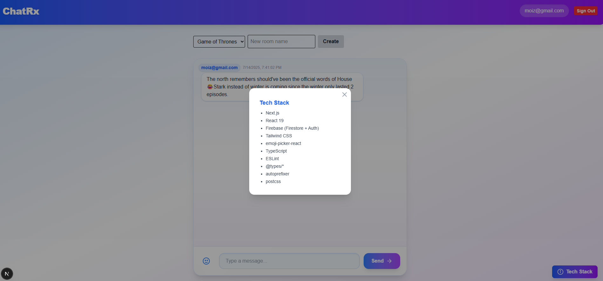

# ChatRx – Real-Time Chat App

ChatRx is a modern real-time chat application built with Next.js, Firebase (Firestore + Auth), and Tailwind CSS. It features email/password authentication, real-time messaging, chat rooms, emoji support, and a beautiful, responsive UI.

## Features
- **Email/Password Authentication** (Firebase Auth)
- **Real-Time Messaging** (Firestore onSnapshot)
- **Multiple Chat Rooms** (create and join rooms)
- **Emoji Picker** for expressive messages
- **Modern UI** with Tailwind CSS and glassmorphism
- **Tech Stack Info** modal

## Screenshots

| Sign In | Sign Up |
|--------|--------|
|  |  |

| Chat Room | Emoji Picker | Tech Stack Modal |
|-----------|-------------|-----------------|
|  |  |  |

## Getting Started

1. **Install dependencies:**
   ```sh
   npm install
   ```
2. **Set up Firebase:**
   - Create a Firebase project
   - Enable Email/Password Auth and Firestore
   - Add your config to `.env.local`:
     ```env
     NEXT_PUBLIC_FIREBASE_API_KEY=your_api_key
     NEXT_PUBLIC_FIREBASE_AUTH_DOMAIN=your_auth_domain
     NEXT_PUBLIC_FIREBASE_PROJECT_ID=your_project_id
     NEXT_PUBLIC_FIREBASE_STORAGE_BUCKET=your_storage_bucket
     NEXT_PUBLIC_FIREBASE_MESSAGING_SENDER_ID=your_sender_id
     NEXT_PUBLIC_FIREBASE_APP_ID=your_app_id
     ```
3. **Run the development server:**
   ```sh
   npm run dev
   ```

## Tech Stack
- Next.js 15 (App Router, TypeScript)
- React 19
- Firebase (Firestore + Auth)
- Tailwind CSS
- emoji-picker-react
- ESLint, PostCSS, Autoprefixer

## License
MIT
